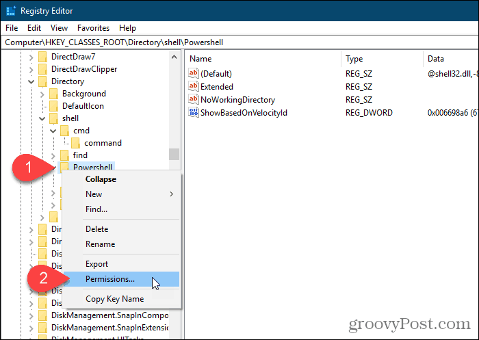

# How to Add the Open command window here Option Back to the Windows Right-Click Menu

Before the Windows 10 Creators Update, the context menu had an option called Open command window here that was available when you pressed **Shift + right-click** on a folder.

Microsoft wants everyone to use PowerShell instead of the Command Prompt. So, in the Creators Update, they changed the **Open command window here** option to **Open PowerShell window here** on the folder context menu. They also changed the Command Prompt options on the Power User Menu (**Windows key + X**) to PowerShell. But we already showed you [how to switch that back](https://www.groovypost.com/howto/find-restore-open-command-prompt-windows-10/).

Today we’ll show you how to add the **Open command window here** option back to the folder right-click menu and to the right-click menu when you’re in a folder. This doesn’t have to replace the **Open PowerShell window here** option. You can have both if you want. But you can also hide the PowerShell option if you don’t want it, and we’ll show you how to do that, too.

## What You Should Do Before Editing the Registry

To make the changes we talk about here, you must make changes to the registry.

The Registry Editor is a powerful tool that can render your system unstable or even inoperable if misused. This is a fairly simple change and if you follow our instructions, you shouldn’t have any problems. But make sure you [back up the Registry](https://www.groovypost.com/howto/microsoft/how-to-backup-restore-registry-in-windows-7-or-vista/) and [back up your computer](https://www.groovypost.com/howto/ultimate-windows-10-backup-and-restore-guide/) before making changes.

You should also [make a System Restore point](https://www.groovypost.com/howto/windows-10-enable-create-system-restore/) before continuing so, if something goes wrong, you can always roll back.

## Add the “Open command window here” Option to the folder context menu

To add the **Open command window here** option to the context menu that displays when you right-click on a folder, press **Windows key + R** to open the **Run** dialog box.

Then, **type:** *regedit* into the **Open** box and click **OK**.

If the **User Account Control** dialog box displays, click **Yes** to continue. You may not see this dialog box, depending on your [User Account Control settings](https://www.groovypost.com/howto/disable-modify-uac-user-account-control-notification-windows/).

Navigate to the following registry key. You can copy the full path below, paste it into the box just under the menu bar, and press **Enter** to get to the key quickly.

HKEY_CLASSES_ROOT\Directory\shell\cmd

[Take ownership of the **cmd** key](https://www.groovypost.com/howto/take-full-permissions-control-edit-protected-registry-keys/) and give yourself full control permission.

Make sure the **cmd** key is selected. Then, right-click on the **HideBasedOnVelocityId** value on the right and select **Rename**.

Change the name of the **HideBasedOnVelocityId** value to **ShowBasedOnVelocityId** and press **Enter**.

Close the Registry Editor and [restart the Windows Explorer process](https://www.groovypost.com/howto/windows-10-file-explorer-not-responding-4-ways-restart-it/).

Now you can **Shift + right-click** on a folder, not in it, and select **Open command window here**.

Notice that the **Open PowerShell window here** option is still there. If you’re not going to use that option, see the next section to hide it.

## Hide the “Open PowerShell window here” Option

If you want to hide the Open PowerShell window here option, go to the following path in the Registry Editor:

HKEY_CLASSES_ROOT\Directory\shell\Powershell

Then, [take ownership of the **Powershell** key](https://www.groovypost.com/howto/take-full-permissions-control-edit-protected-registry-keys/) and give yourself full control permission

Right-click on the **ShowBasedOnVelocityId** value, select **Rename**, and change the name to **HideBasedOnVelocityId**.

Close the Registry Editor and [restart the Windows Explorer process](https://www.groovypost.com/howto/windows-10-file-explorer-not-responding-4-ways-restart-it/).

The **Open PowerShell window here** option is removed from the right-click menu in File Explorer.

## Add the “Open command window here” Option to the Context Menu in an Open Folder

So far, we’ve explained how to add the **Open command window here** option to the context menu when you **Shift + right-click** on a folder, but not in a currently open folder.

You can also enable the **Open command window here** option on the right-click menu in an open folder.

Open the registry editor as we showed you earlier and go to the following key.

HKEY_CLASSES_ROOT\Directory\Background\shell\cmd

[Take ownership of the **cmd** key](https://www.groovypost.com/howto/take-full-permissions-control-edit-protected-registry-keys/) and give yourself full control permission.

Make sure the **cmd** key is selected. In a blank area of the right pane, right-click the **HideBasedOnVelocityId** value, and click **Rename**.

Then, change the name to **ShowBasedOnVelocityId**.

Close the Registry Editor and [restart the Windows Explorer process](https://www.groovypost.com/howto/windows-10-file-explorer-not-responding-4-ways-restart-it/).

Now you can be in a folder, **Shift + right-click** in the right pane of File Explorer, and select **Open command window here**.

## Revert Your Changes

To revert your changes, follow the same instructions listed here, but rename the **ShowBasedOnVelocityId** or **HideBasedOnVelocityId** value to the other, depending on whether you’re showing or hiding the context menu option.
